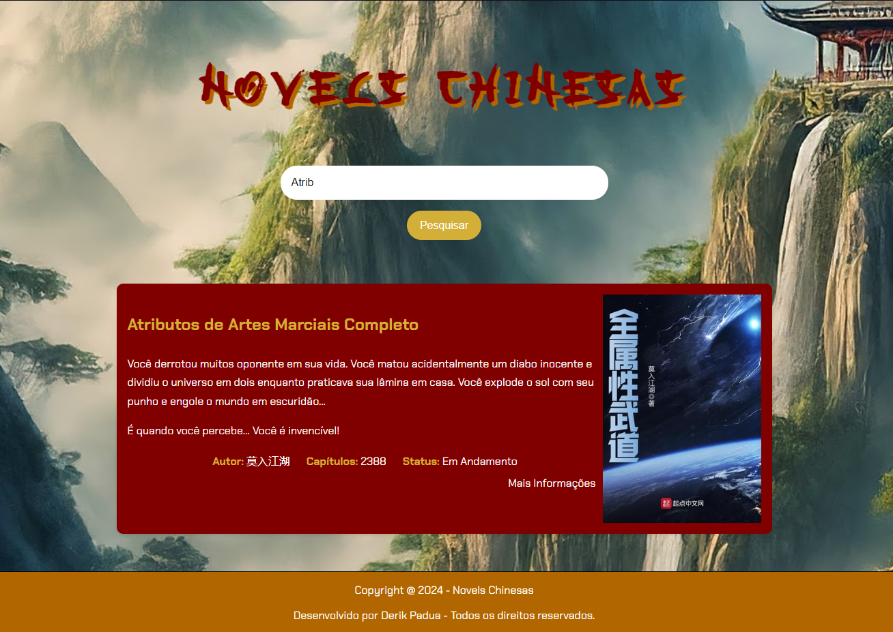

# Novels Chinesas
Projeto desenvolvido durante a Imersão Dev com Google Gemini ministrado pela Alura

[Acesse a Demo aqui](https://novels-chinesas.vercel.app)

## **Seu Guia para a Biblioteca de Novels Chinesas**

### **O que é esse projeto?**

Já pensou em ter uma biblioteca pessoal de suas novels chinesas favoritas, tudo organizado e de fácil acesso? Esse projeto te proporciona exatamente isso! É um site simples e intuitivo onde você pode pesquisar por suas novels, ver detalhes como autor, número de capítulos e até mesmo uma pequena sinopse.

### **Como funciona?**

1. **Pesquisa:** Digite o nome da novel que você procura na barra de pesquisa.
2. **Resultados:** A mágica acontece! Os resultados da sua pesquisa serão exibidos logo abaixo, com informações relevantes sobre cada novel encontrada.
3. **Detalhes:** Clique no botão "Mais Informações" para ser direcionado para a página da novel no NovelUpdates e se aprofundar ainda mais na história.

### **Tecnologias utilizadas:**

* **HTML:** A estrutura básica da página.
* **CSS:** Responsável pelo visual e layout do site.
* **JavaScript:** A parte interativa, que permite a pesquisa e a exibição dos resultados.

### **Como usar este projeto:**

1. **Clone o repositório:** Use o Git para clonar este repositório para sua máquina local.
2. **Abra os arquivos:** Abra os arquivos HTML, CSS e JavaScript em seu editor de código favorito.
3. **Personalize:** Sinta-se à vontade para personalizar o visual, adicionar novas funcionalidades ou até mesmo trocar as novels da lista.

### **Contribuindo:**

Quer ajudar a melhorar este projeto? Fique à vontade para abrir um pull request! Se você encontrar algum bug, tiver alguma sugestão ou quiser adicionar novas funcionalidades, sua contribuição será muito bem-vinda.

### **Observações:**

* **Dados das novels:** Os dados das novels estão armazenados no arquivo `basedados.js`. Você pode adicionar, remover ou editar as informações das novels nesse arquivo.
* **Design:** O design do site é simples e funcional, mas você pode personalizar o CSS para deixá-lo com a sua cara.
* **Funcionalidades futuras:** Existem diversas possibilidades para expandir este projeto, como adicionar um sistema de favoritos, permitir que os usuários adicionem suas próprias novels, ou até mesmo criar um sistema de recomendações.

**Vamos juntos construir a melhor biblioteca de novels chinesas da internet!**

** Divirta-se explorando o mundo das novels chinesas! **
